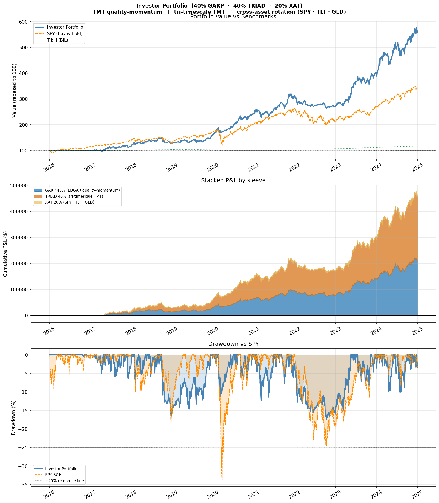
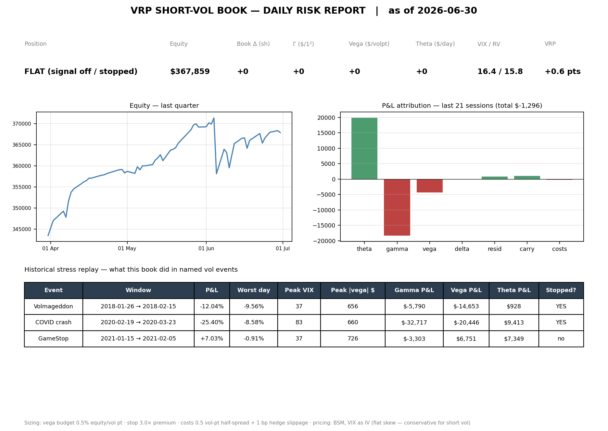

# Strategy Backtester

A systematic trading backtester with a live paper-trading arm on Alpaca. Data comes from Alpaca (SIP feed), SEC EDGAR (fundamentals), and CBOE (VIX history) — no yfinance, no paid data.

The repo is organized by mandate, the way a trading floor is: `strategies/equities/` is the core US equity book (single-name TMT momentum, index mean-reversion, factor rotation — this is what actually runs live), `strategies/vol/` is the options desk (short-vol VRP), and `strategies/cross_asset/` is a separate multi-asset research line, kept apart on purpose rather than blended into the equity book. See "Research Log" for why that separation exists.





## Contents

| Strategy | Period | Notes |
|---|---|---|
| Investor Portfolio (GARP + TRIAD + T-bills) | 2016–2024 | The live allocation |
| TRIAD (Tri-Timescale TMT) | 2016–2026 | 2025+ is out-of-sample |
| GARP Momentum | 2016–2024 | EDGAR fundamentals from ~2009 |
| VRP (short-vol options) | 2016–2026 | Synthetic pricing off the VIX |
| DTQ (Dual-Timescale QQQ) | 2016–2024 | |
| BTREND (Broad Cross-Asset Trend) | 2016–2026 | Candidate diversifier, not yet allocated |
| AFP, XAT, Tech-Tier | 2016–2024 | Reference only |
| SIS (intraday) | 2020–2024 | Alpaca 5-min bars start in 2020 |

All engines use the same execution convention: a signal computed from today's close is entered at that close and earns tomorrow's return. Live, that's a market order around 15:25 ET, roughly 30 minutes before the actual close. Costs are 10bps per unit of turnover unless noted.

---

## Investor Portfolio

**`strategies/equities/combined_portfolio/`** — Sharpe 1.33, +478% total return, −16.9% max drawdown, 2016–2024. SPY over the same window: +237%.

| Sleeve | Weight | What it is |
|---|---|---|
| GARP | 45% | TMT quality-momentum, EDGAR fundamentals |
| TRIAD | 45% | Tri-timescale TMT — momentum plus panic dips |
| T-bills | 10% | BIL, held as an actual position |

The three sleeves rebalance back to 45/45/10 every day, which matches what the live system actually does — the backtest isn't measuring a buy-and-hold blend, it's measuring the portfolio that trades.

GARP and TRIAD trade the same 15-stock TMT universe with different selection logic: GARP screens on fundamental quality (EDGAR data) plus momentum, TRIAD is pure price action across three timescales. Standalone, TRIAD is better (Sharpe 1.49 vs 1.14), and TRIAD was built on this same window, so some of that edge is probably research bias that GARP's more mechanical fundamentals process is less exposed to. The two also fail differently — GARP's quality screen tends to hold through momentum crashes that TRIAD would rotate out of faster. Splitting 45/45 costs about 1.2%/yr in expectation (GARP wins 44% of months, correlation between the two is 0.83) in exchange for not betting the whole book on TRIAD's edge being exactly as measured. TRIAD earned its weight after an 18-month out-of-sample test came back at Sharpe 1.38.

The 10% T-bill sleeve exists because GARP and TRIAD are still one bet — long US mega-cap tech momentum — dressed up two ways. Nothing inside either engine protects against a multi-year unwind of that theme, which this backtest window never contained. It used to be a 20% cross-asset trend allocation (XAT); T-bills beat it outright, see the research log below. Live, BIL isn't just the fixed 10% — it's a sweep that absorbs everything the risk overlays leave uninvested, so idle capital earns the T-bill rate instead of sitting at zero.

---

## The Two Alpha Engines

### GARP Momentum
**`strategies/equities/garp_momentum/`** — Sharpe 1.14, +529%, −20.5% max DD, 2016–2024.

Growth-at-a-reasonable-price screening on 15 large-cap TMT names (AAPL, MSFT, GOOGL, META, NVDA, AMD, AVGO, QCOM, ORCL, CRM, ADBE, NFLX, AMZN, TSLA, INTC), combined with Jegadeesh-Titman momentum.

| Ratio | Weight | What it measures |
|---|---|---|
| PEG | 30% | P/E divided by growth rate |
| ROE | 20% | Profitability quality |
| EV/EBITDA | 15% | Valuation vs earnings power |
| FCF yield | 15% | Cash generation |
| Net margin | 10% | Pricing power |
| Debt/equity | 10% | Balance sheet risk |

Composite rank is 65% momentum (3/6/12-month, 1-month skip) and 35% GARP score. Holds the top 5 monthly, weighted by quality, capped at 30% per name. Three overlays manage risk: a 20% vol target, an SPY regime filter that cuts exposure to 0.6x/0.3x in downtrends, and a 15% drawdown stop that goes to cash for 21 trading days. Turnover runs about 8x a year.

Fundamentals come straight from SEC EDGAR's XBRL API — every filing has an exact `filed` timestamp, so point-in-time accuracy is built in rather than approximated. Coverage goes back to roughly 2009 for these names. One known gap: AVGO's XBRL tagging stops matching cleanly after its 2024 10-K, so its score is stale until that's fixed.

### TRIAD — Tri-Timescale TMT
**`strategies/equities/triad/`** — Sharpe 1.47, +975%, −18.6% max DD, 2016–2026 (2025 onward is out-of-sample).

Same 15-stock universe as GARP, but the idea is different: instead of picking better stocks, harvest the same factor at three speeds.

| Sleeve | Weight | Speed | What it does |
|---|---|---|---|
| Leaders | 60% | Monthly | Top-3 momentum names, equal weight, vol-targeted, cut to 0.3x below QQQ's 200-day SMA |
| Stock dips | 25% | Days | Buys single-name panic closes (IBS < 0.10) in uptrends; exits on strength or after 3 days |
| Index dips | 15% | Days | DTQ's QQQ mean-reversion sleeve, reused as-is |

The three sleeves correlate at only 0.33–0.56 with each other, so the blend's Sharpe beats any one alone. Leaders does the heavy lifting — about $464k of the $619k total return over 2016–2024 — while the dip sleeves smooth things out by putting capital to work on exactly the days Leaders is losing. The tradeoff is turnover: the dip sleeves push TRIAD to roughly 33x a year, making it the strategy most exposed to the 10bps cost assumption.

Sub-period Sharpe actually improves as things get harder — 1.10 in 2016–19, 1.44 in 2020–22, 2.18 in 2023–24 — because the dip engines earn the most when volatility is up. A parameter grid over lookback windows and top-N holds Sharpe between 1.22 and 1.53 across every combination, so this isn't a single lucky setting.

**Out-of-sample, 2025-01 through 2026-06** (frozen parameters, genuinely untouched data): +49.6% return, Sharpe 1.38, max drawdown −13.9%, against QQQ's +45.1%/1.08/−22.8%. The in-sample Sharpe of 1.49 degrading to 1.38 is the kind of haircut a real edge takes — a curve-fit one usually collapses much harder. The regime scaler did its job in the spring 2025 correction (TRIAD −13.9% vs QQQ −22.8%), and the NVDA-dependence worry from the in-sample period didn't show up — top holdings out-of-sample were AVGO, GOOGL, and AMD. TRIAD actually lagged QQQ in two of the three out-of-sample half-years and made it all back on drawdown protection plus one strong run — worth knowing going in, since most calm quarters it'll look like it's behind.

Two things worth being honest about: TRIAD's daily correlation with GARP is 0.83, so together they diversify model risk, not market risk — in a real multi-year tech bear all three sleeves degrade together, and the 200-day regime scaler is the only real defense. And NVDA was the top holding on 31% of in-sample days, which flatters the backtest more than a forward-looking investor should expect.

---

## Options / Volatility

### VRP — Short Volatility Risk Premium
**`core/options.py`** (pricing) · **`strategies/vol/vrp_short_vol/`** (strategy) — Sharpe 1.11, +268%, −25.6% max DD, 2016–2026.

Implied vol trades above realized vol most of the time, because option buyers pay a premium to hedge tail risk. This book sells that premium directly: short a 25-delta SPY strangle whenever VIX minus EWMA realized vol clears 1 point at the monthly roll, delta-hedged daily, sized to survive the tail rather than to look good on an average day.

A few specifics:

- Positions are priced with Black-Scholes (`core/options.py` — closed-form prices, greeks, an implied-vol solver, delta-to-strike inversion, all checked against finite differences).
- Vega is budgeted at 0.5% of equity per vol point, calibrated so a COVID-scale VIX spike marks around −25% before gamma losses on top. A hard stop closes the position at 3x premium received.
- Delta hedging is the whole point: unhedged, the identical signal is Sharpe 0.44 with a −34% drawdown. Hedged, after paying the bid-ask (0.5 vol-pt half-spread per leg) and hedge slippage, it's 1.11 and −25.6%. That gap is the real product — turning a directional gamble into something closer to a harvestable premium.
- P&L is attributed daily to delta, gamma, vega, and theta, and the four (plus a residual and costs line) sum exactly to total P&L — checked by a test, not just eyeballed. Across the full period: theta collected +$897k, gamma paid back −$563k, vega marks −$100k, costs −$62k.
- Three named stress windows: Volmageddon (Feb 2018, −12.0%, stopped out), COVID (Feb–Mar 2020, −25.4%, stopped — landing almost exactly where the sizing was calibrated for), and GameStop (Jan 2021, +7.0% — a single-stock event that spiked and collapsed index vol without doing much damage to a diversified index book).
- `outputs/vrp_risk_report.png` is a one-page summary — position, greeks, recent P&L attribution, stress table — built to be shown on a screen, not read line by line.

There's no free historical options data, so pricing is synthetic: Black-Scholes with the VIX as implied vol for both legs, which means flat skew and a flat term structure. Flat skew actually underprices the put wing relative to reality, so if anything this understates what a real short-vol seller collects. The mechanics — sizing, the stop, the hedge, the attribution — are the real thing; the dollar totals are a model-world approximation.

VRP is **not** part of the live portfolio. It's a research and demonstration layer — see "is it worth allocating to" below for why it stays that way for now.

---

## Everything Else

### DTQ — Dual-Timescale QQQ
**`strategies/equities/dual_timescale_qqq/`** — Sharpe 1.30, +185%, −9.8% max DD, 2016–2024.

The lowest drawdown in the repo, and the origin of TRIAD's mean-reversion sleeve. Trend-following and dip-buying respond to opposite behaviors — continuation vs overreaction — so running both on QQQ alone gets two nearly uncorrelated return streams (0.40 correlation) without needing a second asset. Trend sleeve is long QQQ above its 200-day SMA, vol-targeted; mean-reversion buys panic closes (IBS < 0.10) inside that same uptrend and exits within 3 days. Split 50/50, Sharpe goes from 1.02 / 1.19 standalone to 1.30 combined, and stays positive in every sub-period including the 2022 bear (where the trend filter simply parked the whole thing in T-bills while QQQ fell 35%). A parameter grid confirms this isn't overfit — Sharpe stays between 1.09 and 1.33 across a wide range of SMA and IBS settings. Kept standalone rather than folded into the main portfolio because it would just add more Nasdaq beta on top of what GARP and TRIAD already carry.

### BTREND — Broad Cross-Asset Trend
**`strategies/cross_asset/broad_trend/`** — Sharpe 0.33, +46%, −7.8% max DD, 2016–2026.

Per-asset long/short trend-following (Moskowitz-Ooi-Pedersen) across 17 ETFs spanning equities, rates, credit, commodities, and currencies. The point isn't standalone return, it's being genuinely uncorrelated with the main portfolio — 0.22 correlation, vs 0.83 between GARP and TRIAD — and it's the first diversifier tested that actually beats plain T-bills, mostly because of the short side (short bonds and yen through 2021–22 while both stocks and bonds fell). It's a validated candidate for some of that 10% T-bill slot, not yet allocated, because shorting introduces live mechanics (margin, borrow costs) the paper account hasn't exercised yet. Same promotion bar as TRIAD: prove it live first.

### AFP — Adaptive Factor Portfolio
**`strategies/equities/equity_factor_rotation/`** — Sharpe 0.72, +102%, −13.6% max DD, 2016–2024.

Monthly rotation across four factor ETFs (QQQ, QUAL, MTUM, USMV) with a leadership tilt and a correlation-regime filter that cuts exposure to 40% when QQQ and USMV start moving together — a proxy for "diversification has broken down." Caught both the 2020 crash and the 2022 rate shock without needing VIX data. Its engine also powers XAT below.

### XAT — Cross-Asset Trend (retired)
Same engine as AFP, run on SPY/TLT/GLD. This was the portfolio's diversifier sleeve until mid-2026, when a corrected backtest showed T-bills beat it outright at every weight tested, including in the crises it existed to defend. See the research log for the numbers.

### SIS — SPY Intraday Afternoon Short
**`strategies/equities/spy_intraday_short/`** — Sharpe 0.10, +14%, −5.8% max DD, 2020–2024.

Shorts the last 30 minutes of the session on high-conviction mornings (overnight gap and first-30-minute move both strong and agreeing). The low headline Sharpe is mostly an artifact of only being active 18% of days — win rates (61–62%) suggest the signal itself is fine. Excluded from the main portfolio because its intraday data only exists from 2020 onward.

### Tech-Tier Momentum Ladder
**`strategies/equities/concentrated_momentum/`** — Sharpe 0.54, +305%, −34.3% max DD, 2016–2024. Concentrates monthly into whichever of SOXX/QQQ/SPY has the best momentum. Works, but the drawdown is too much to run as a primary strategy.

---

## Research Log

A record of what was tried, what got kept, and why — mostly so decisions don't get silently re-litigated later.

**How the portfolio's weights evolved:**

| Configuration | Return | Sharpe | Max DD | Period |
|---|---|---|---|---|
| 40/40/20 GARP/XAT(no SPY)/SIS | +63% | 0.84 | −15.9% | 2020–2024 |
| 45/45/10 GARP/XAT(with SPY)/SIS | +69% | 0.84 | −17.6% | 2020–2024 |
| 70/20/10 GARP/XAT/SIS | +116% | 1.08 | −18.8% | 2020–2024 |
| 80/20 GARP/XAT | +364% | 1.03 | −21.3% | 2016–2024 |
| 40/40/20 GARP/TRIAD/XAT | +371% | 1.27 | −17.0% | 2016–2024 |
| **45/45/10 GARP/TRIAD/T-bills** | **+478%** | **1.33** | **−16.9%** | **2016–2024** |

(Rows above the last two used an older, slightly generous backtest methodology — see the fix below — so treat them as decision history, not an apples-to-apples comparison.)

**A timing bug fix that mattered.** The combined backtest used to sum each sleeve's buy-and-hold value rather than rebalancing the mix daily, which let winners drift the allocation away from 45/45/10 for years at a time — not what the live system does. Fixing that dropped the headline return but left Sharpe and drawdown basically unchanged, and it's what exposed how weak XAT actually was: constantly rebalancing gains into a flat sleeve is a real cost that the old method was hiding. Separately, TRIAD's Leaders sleeve was entering positions a day later than intended (a double-lag bug), and AFP/XAT had a one-day lookahead in their vol sizing. Both are fixed; every number in this document reflects the correction.

**Why T-bills replaced XAT.** Once the backtest was rebalancing correctly, every plausible weighting was re-tested on identical sleeve returns:

| Config | Return | Sharpe | Max DD | COVID | 2022 |
|---|---|---|---|---|---|
| 40/40/20 with XAT | +371% | 1.22 | −17.0% | −8.3% | −13.0% |
| 45/45/10 with XAT | +467% | 1.25 | −17.8% | −9.3% | −14.4% |
| 50/50, no diversifier | +581% | 1.27 | −18.6% | −10.3% | −15.8% |
| **45/45/10 with T-bills** | **+478%** | **1.27** | **−16.8%** | −9.3% | −14.3% |
| 40/40/20 with T-bills | +389% | 1.27 | −15.0% | −8.3% | −12.7% |

T-bills won on every metric at every weight, including the two crises XAT was supposed to help with. A pure 50/50 GARP/TRIAD book backtests best of all, but that's two flavors of the same tech-momentum bet run at full size through the friendliest window in memory for that bet — the 10% cash sleeve is the price of not pretending otherwise.

**Then BTREND, to settle the actual question.** XAT's failure left it unclear whether cross-asset trend just doesn't work, or whether XAT's specific implementation (3 assets, long-only) was too narrow to express it. Testing a broad long-only trend book answered half of it — still dominated by T-bills, so breadth alone wasn't the fix. Allowing shorts changed the picture completely: Sharpe 0.33 standalone, 0.22 correlation with the main book, and — this is the part that matters — positive through both COVID and the 2022 rate shock, the two windows every other diversifier failed. It's a validated candidate, not yet allocated; see the BTREND section above for why.

**Is the options strategy worth allocating to?** Short answer: not yet, and possibly not in this form. The hedged Sharpe of 1.11 is respectable — comparable to the equity engines — but it isn't obviously additive to the portfolio, and the reason is more important than the Sharpe number. VRP's daily returns correlate at **0.41** with the main portfolio, and on the portfolio's 60 worst days historically, VRP averaged **−1.2%** against its normal daily average of **+0.05%**. That's the textbook problem with short volatility: it loses money at the same time everything else does, because a market crash is both a drawdown for long equity books and a vol spike for anyone short gamma. It isn't a hedge, it's closer to a second way of losing on the same bad days. Sized conservatively as it is here — the book runs at roughly 0.3% of equity in average vega exposure, nowhere near what an institutional desk would run against the same capital — the absolute dollar return is modest precisely because the position stays small enough to survive its own stress test. That's a deliberate, defensible choice, not an accident, but it does mean this strategy earns its keep as a demonstration of options mechanics and risk thinking rather than as a source of portfolio alpha. If it ever gets allocated, it would need either a genuine crash hedge (long puts, negatively correlated by construction) sitting next to it, or sizing rules that scale with how wide the premium is rather than a fixed vega budget.

**Why GARP stays TMT-only.** Tried expanding from 15 names to 25 across five sectors — return dropped from +130% to +90% and Sharpe from 1.12 to 0.81 over 2020–2024. Diluting into decent-but-not-great momentum names hurt more than diversifying helped, at least in a window this favorable to tech. Might flip in a different regime; the backtest data just doesn't reward it here.

**Why SIS stays out of the main portfolio.** Purely a data problem — its 5-minute bars only go back to 2020, and folding it in would cost 4 years of the EDGAR-powered GARP history. The signal itself looks fine; it's kept as a reference strategy.

---

## Project Structure

```
├── core/
│   ├── alpaca.py          Alpaca API client (auth, pagination, caching)
│   ├── data.py            Price / T-bill / VIX fetchers
│   ├── options.py         Black-Scholes pricing, greeks, implied vol
│   └── metrics.py         Sharpe, drawdown, win rate
│
├── strategies/
│   ├── equities/               Single-name / index US equity — the core book
│   │   ├── combined_portfolio/    The live allocation (45% GARP + 45% TRIAD + 10% T-bills)
│   │   ├── garp_momentum/         GARP — includes fundamentals.py, the EDGAR scoring
│   │   ├── triad/                 TRIAD
│   │   ├── dual_timescale_qqq/    DTQ
│   │   ├── equity_factor_rotation/ AFP (also powers the retired XAT experiment)
│   │   ├── spy_intraday_short/    SIS
│   │   └── concentrated_momentum/ Tech-Tier ladder
│   │
│   ├── vol/                    Options / volatility
│   │   └── vrp_short_vol/         VRP — includes risk_report.py, the one-pager
│   │
│   └── cross_asset/             Multi-asset systematic research (not part of the equity book)
│       └── broad_trend/           BTREND
│
├── live/                  Live paper trading on Alpaca
│   ├── rebalance.py       Daily: compute targets, submit orders
│   ├── reconcile.py       Morning: record equity, check fills
│   ├── tearsheet.py       Monthly: live performance vs backtest
│   ├── signals.py         Shared weight functions (same code the backtests use)
│   ├── broker.py          Thin Alpaca trading API wrapper
│   └── config.py
│
├── tests/                 No-lookahead checks, golden numbers, timing tests
├── data_cache/            Cached downloads (gitignored)
├── outputs/               Charts, CSVs, and the live track record
├── config.py              Shared dates, capital, paths
└── requirements.txt
```

Each strategy folder is `main.py` (run this), `backtest.py` (the engine), `config.py` (the parameters).

---

## Running

```bash
python -m strategies.equities.combined_portfolio.main      # the live allocation

python -m strategies.equities.garp_momentum.main
python -m strategies.equities.triad.main                    # extends to 2026-06 for out-of-sample
python -m strategies.vol.vrp_short_vol.main             # options layer + risk report
python -m strategies.equities.dual_timescale_qqq.main
python -m strategies.cross_asset.broad_trend.main               # extends to 2026-06
python -m strategies.equities.equity_factor_rotation.main
python -m strategies.equities.spy_intraday_short.main
python -m strategies.equities.concentrated_momentum.main
```

## Live Paper Trading

The investor portfolio runs daily on an Alpaca paper account, mainly so there's a track record that can't be curve-fit after the fact.

```bash
# Rebalance — only trades in the final 45 min of the session
python -m live.rebalance              # dry run, prints orders, submits nothing
python -m live.rebalance --execute    # submits market orders
python -m live.rebalance --force      # run even if market is closed, for testing

# Reconcile — any time after the close
python -m live.reconcile              # records equity, checks fills against orders

# Tearsheet — monthly, once there's at least 5 days of history
python -m live.tearsheet
```

Scheduled from Singapore with two cron entries covering both possible US close times, so daylight saving doesn't need to be tracked manually — the job checks the actual market clock and exits if it's outside the trading window:

```cron
25 3 * * 2-6  cd ~/trading/backtester && python3 -m live.rebalance --execute >> outputs/live/cron.log 2>&1
25 4 * * 2-6  cd ~/trading/backtester && python3 -m live.rebalance --execute >> outputs/live/cron.log 2>&1
0  7 * * 2-6  cd ~/trading/backtester && python3 -m live.reconcile          >> outputs/live/cron.log 2>&1
```

Every rebalance writes a full decision log to `outputs/live/decisions/` — inputs, target weights, orders — so any gap between live and backtest can be replayed later rather than argued about.

**Known differences from the backtest:**

| Difference | Why | Impact |
|---|---|---|
| Signal prices are ~15:19 ET, not the official close | Free Alpaca data can't see the last 15 minutes | Minor noise |
| Fills happen ~30 min before the close via market order | Alpaca's paper simulator doesn't reliably fill true market-on-close orders | A few bps of slippage vs the closing auction |
| Whole shares only, trades under $200 skipped | Simplifies rebalancing | A few bps of weight drift on a $100k account |
| Drawdown stop is portfolio-level, not per sleeve | Per-sleeve stops need virtual equity tracking | Same magnitude, slightly different timing |
| ~2% cash buffer earns nothing | Reserved so buy orders don't bounce on same-day sales | Roughly 8bps/yr, down from ~2%/yr before the cash sweep was added |

EDGAR fundamentals refresh weekly in the live system so new filings flow into GARP's score; backtests keep a permanent cache for reproducibility.

## Testing

```bash
python -m pytest tests/ -q     # a few seconds, runs off data_cache/
```

Three kinds of tests, added after a timing audit turned up bugs that had been sitting untested for months:

- **No-lookahead checks** — every engine's weights must be unchanged if you truncate the price history, and unchanged if you perturb only the final day's price (this second check catches the subtler bug: a position sized using data from a day it hasn't been entered yet).
- **Golden numbers** — each engine has to reproduce its documented return/Sharpe/drawdown on the cached data.
- **Timing tests** — synthetic data confirms a decision made at close D earns from D to D+1, no more, no less.

All three test types were validated by deliberately reintroducing the bugs they were built to catch and confirming the tests fail.

## Setup

```bash
pip install pandas numpy matplotlib markdown pytest
```

Add Alpaca paper-trading keys to `.env`:
```
ALPACA_KEY=your-key-id
ALPACA_SECRET=your-secret
```

First run downloads and caches everything; later runs are instant.

## Data Sources

| Data | Source | Notes |
|---|---|---|
| Daily prices | Alpaca SIP, `adjustment=all` | Total return, ~2016 onward |
| SPY intraday | Alpaca SIP, 5-min bars | 2020 onward, SIS only |
| VIX | CBOE official daily history | Free, back to 1990 |
| T-bill proxy | BIL ETF | SPDR 1–3 month T-bill |
| Fundamentals | SEC EDGAR XBRL API | Exact filing dates, ~2009 onward |

---

*Mark Garcera · NUS Computer Science · CFA Level I*
